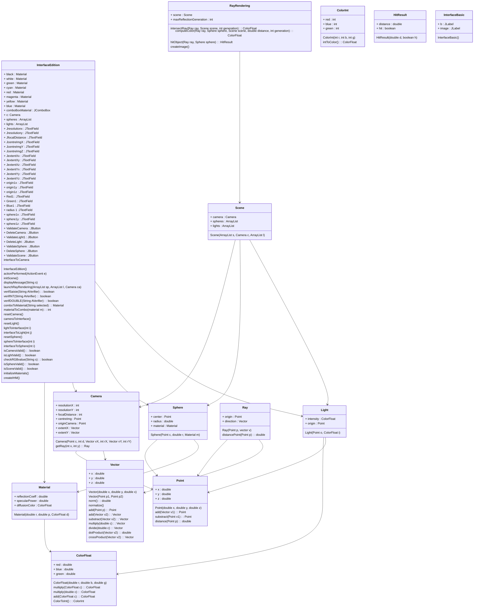

# Minimal-Ray-Tracing

The program contained in this archive computes the image of a scene composed of spheres and lights from a camera position by using a ray tracing algorithm.

// Camera Class
attributes: a double as its focal distance, a Point as the origin of the camera, 
            a Point as the center of the plane of the image; 2 vectors defining the orientation of the plane of the image in space and its size; 2 ints defining the number of pixels of the image
methods: getRay (int, int)

// ColorFloat Class
attributes: 3 doubles parameters defining the red, green, blue components of the color between 0-1.
methods: multiply (ColorFloat); multiply (double); add (ColorFloat); colorToInt ()

// ColorInt Class
attributes: 3 int parameters defining the red, green, blue components of the color between 0-255.
methods: none

// HitResult Class
attributes: a double as a distance, a boolean as an indicator if the ray hhas hitten the object or not
methods: none

// Interface Class   

// InterfaceBasic Class
attributes: two JLabels
methods: none

// InterfaceEdition Class
attributes: several Materials, several JButtons and several JTextField that create the interface, and a Camera and two ArrayList made of Spheres and Lights
methods: actionPerformed (actionEvent); initScene (); displayMessage (String); launchRayRendering (ArrayList<Sphere>, ArrayList<Light>, Camera); verifSaisie (String); verifINT (String); verifDOUBLE(String); comboToMaterial (String); materialToCombo (Material); resetCamera () ; interfaceToCamera (); cameraToInterface (); resetLight (); lightToInterface (int); InterfaceToLight (int); resetSpher (); sphereToInterface (int); interfaceToSphere (int); isCameraValid (); isLightValid(); checkRGBValue(String); isSphereValid (); isSceneValid (); initializeMaterials (); createIHM ()

// Light Class
attributes: a Point of origin, a Color of Intensity
methods: none

// Main Class
launches the interface

// Material Class
attributes: a double as its coefficient of reflection, a double as its specular power, a Color of diffusion
methods: none

// Point Class
attributes: 3 double as position coordinates : x, y, z
methods: add (Vector); substract (Point); distance (Point)

// Ray Class
attributes: a point of Origin, a Vector of direction
methods: distancePoint (Point)

// RayRendering Class
attributes: a Scene, an int defining the maximum number of times a ray can be reflected 
methods: intersectRay (Ray, Scene, int); computeColor (Ray, Scene, Sphere, double, int); hitObject (Ray, Sphere); createImage ()

// Scene Class
attributes: a Camera, a list of Spheres, a list of Lights
methods: none

// Sphere Class
attributes: a radius, a Point as centre, a Material
methods:none

// Vector Class
attributes: 3 double as position coordinates : x, y, z
methods: norm (); normalize (); add (Point); add (Vector); substract (Vector); multiply (double); divide (double); dotProduct (Vector); crossProduct (Vector)

## Class Diagram

