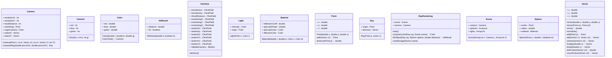

# Minimal-Ray-Tracing

Compute image of a scene composed of Spheres.

## Class Diagram

```mermaid
classDiagram
    class Camera{
        + resolutionX : int
        + resolutionY : int
        + focalDistance : int
        + centreImg : Point
        + originCamera : Point
        + extentX : Vector
        + extentY :  Vector
        Camera (Point c, int d, Vector vX, int rX, Vector vY, int rY)
        computeRay (double percentX, double percentY) Ray
    }
    class ColorInt{
        + red : int
        + blue : int
        + green : int
        Color (int r, int b, int g)
    }
    class Color{
        + red : double
        + blue : double
        + green : double
        Color (double r, double b, double g)
        ColorToInt () : ColorInt
    }
    class HitResult{
        + distance : double
        + hit : boolean
        HitResult (double d, boolean h)
    }
    class Interface{
        + Jresolutionx : JTextField
        + Jresolutiony : JTextField
        + JfocalDistance : JTextField  
        + JcentreImgX : JTextField
        + JcentreImgY : JTextField  
        + JcentreImgZ : JTextField  
        + JextentXx : JTextField
        + JextentXy : JTextField  
        + JextentXz : JTextField
        + JextentYx : JTextField
        + JextentYy : JTextField
        + JextentYz : JTextField
        + ValidateCamera : JButton
        Interface()
    }
    class Light{
        + intensity : Color
        + origin : Point
        Light(Point o, Color i)
    }
    class Material{
        + reflectionCoeff : double
        + specularPower : double
        + specularColor : Color
        + diffusionColor : Color
        Material (double r, double p, Color s, Color d)
    }
    class Point{
        + x : double
        + y : double
        + z : double
        Point (double x, double y, double z)
        add (Vector v1) : Point
        distance (Point p) : double
    }
    class Ray{
        + origin : Point
        + direction : Vector
        Ray (Point p, vector v)
    }
    class RayRendering{
        + scene : Scene
        + camera : Camera
        main () 
        computeColor (Ray ray, Scene scene) : Color
        hitObject (Ray ray, Sphere sphere, double distance) : HitResult
        createImage (Scene scene)
    }
    class Scene{
        + camera : Camera
        + spheres : ArrayList<Sphere>
        + lights : ArrayList <Light>
        Scene (ArrayList<Sphere> s, Camera c, ArrayList<Light> 1)
    }
    class Sphere{
        + center : Point
        + radius : double
        + material : Material
        Sphere (Point c, double r, Material m)
    }
    class Vector{
        + x : double
        + y : double
        + z : double
        Vector (double x, double y, double x)
        Vector (Point p1, Point p2)
        norm() : double
        normalize() 
        add(Point p) : Point
        add(Vector v1, Vector v2) : Vector
        substract(Vector v2) : Vector
        multiply(double c) : Vector
        divide(double c) : Vector
        dotProduct(Vector v2) : double
        crossProduct(Vector v2) : Vector
    }
```

